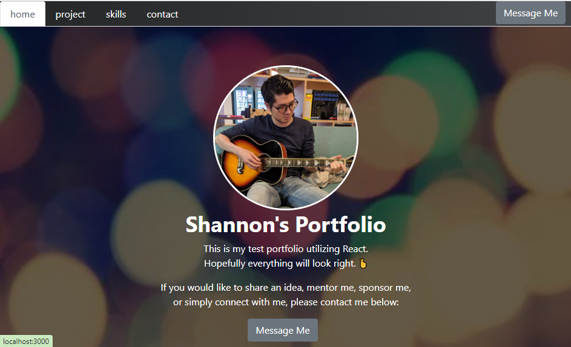

# readme-generator-shannon

## Description

As a review of the materials we learnt in our thirteenth week, our **Week 13 Challenge** will test our skills in React by having us create a Modern Development with React.

In this web application, I have applied the following skills:

>00. React
>01. JavaScript
>02. Node.js
>03. Google-fu
>04. Google-fu
>05. Lots of tears
>06. Google-fu
>07. Googling Youtube
>08. Google-fu

## Installation

You'll need the below installed in order for the portfolio to work:

Chrome Browser, Visual Code Studio

## Usage 

Download the repository to your local device and run 'npm install' in the terminal

Then Run the following command:

'npm start'

Screenshot of deployed application:

## Credits

Philip Howley (Instructor) 
Nic Catania (TA) 
Pod-4 mates 
Myself

## License

## Badges

